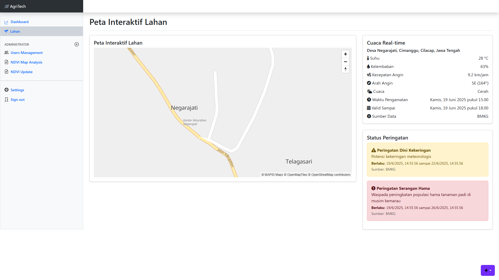
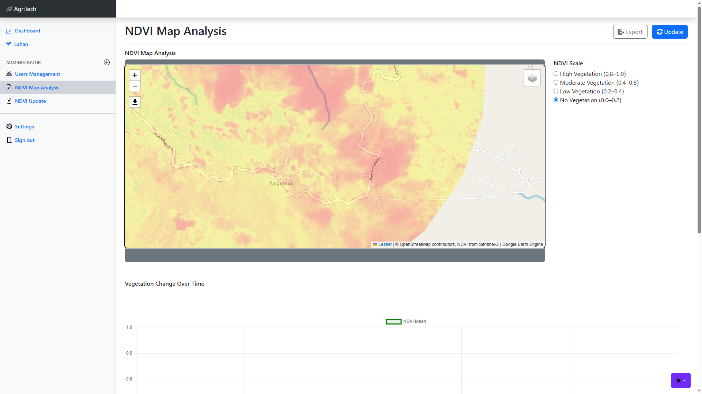
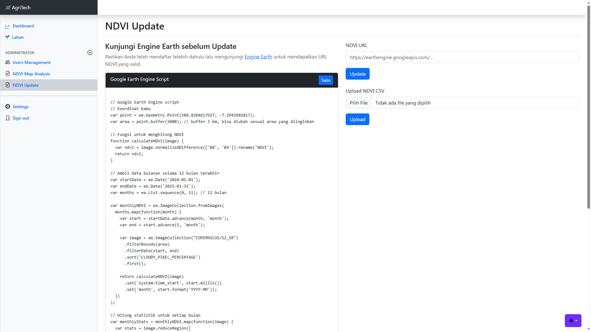

# 🗺️ Web GIS Monitoring Lahan Pertanian Berkelanjutan  
### Desa Negarajati, Kecamatan Cimanggu, Kabupaten Cilacap

Sistem ini merupakan aplikasi **Web GIS** (Geographic Information System) yang dikembangkan untuk membantu monitoring lahan pertanian secara **berkelanjutan** di Desa Negarajati. Aplikasi ini bertujuan untuk menyajikan informasi spasial dan data NDVI (Normalized Difference Vegetation Index) guna mendukung pengambilan keputusan dalam sektor pertanian secara efektif dan efisien.

---

## 🎯 Tujuan Proyek

- Menyediakan visualisasi peta lahan pertanian secara interaktif berbasis web.
- Menampilkan informasi kondisi vegetasi berdasarkan data NDVI.
- Menyediakan alat bantu monitoring pertanian berbasis spasial untuk pemerintah desa dan stakeholder.

---

## 🛠️ Teknologi yang Digunakan

- **Backend**: Laravel 8 (PHP)
- **Database**: SQLite / MySQL
- **Frontend**: Leaflet.js, Bootstrap
- **GIS Tools**:  
  - Google Earth Engine (untuk perolehan data NDVI)
  - leaflet-easyPrint (untuk ekspor peta)
  - QGIS (untuk praproses shapefile dan data GeoJSON)
- **Data Peta**: GeoJSON, Satellite Basemap

---

## 🌱 Fitur Utama

- 🌍 **Peta Interaktif** lahan pertanian di Desa Negarajati  
- 🟢 **Monitoring NDVI** (kesehatan vegetasi) secara berkala  
- 🧾 **Ekspor Peta** ke format PDF untuk keperluan laporan atau dokumentasi  
- 📦 **Manajemen Data** lahan, NDVI, dan metadata lainnya melalui dashboard admin  
- 🔍 **Filter dan Pencarian** berdasarkan tanggal dan blok lahan tertentu  

---

## 🧪 Dataset

- **NDVI**: Diambil dari citra satelit Sentinel-2 melalui platform Google Earth Engine.
- **Data lahan**: Data spasial hasil digitasi dari peta desa menggunakan QGIS, disimpan dalam format GeoJSON.
- **Metadata tambahan**: Informasi blok lahan, nama pemilik, potensi hasil panen (opsional).

---

## 🚀 Instalasi (Developer)

1. Clone repository:
   ```bash
   git clone https://github.com/AgusFROST/AgriTech.git
   cd AgriTech
    ````

2. Install Laravel dependencies:

   ```bash
   composer install
   ```

3. Salin dan sesuaikan konfigurasi `.env`:

   ```bash
   cp .env.example .env
   php artisan key:generate
   ```

4. Buat database dan jalankan migrasi:

   ```bash
   php artisan migrate
   ```

5. Jalankan server Laravel:

   ```bash
   php artisan serve
   ```

---

## 📸 Screenshot 


### 🗺️ Tampilan Peta Interaktif

---

### 🗺️ NDVI Map Analysis

---

### 🗺️ Update NDVI

---

## 📍 Lokasi Penerapan

> **Desa Negarajati**, Kecamatan Cimanggu, Kabupaten Cilacap, Jawa Tengah, Indonesia.

---

